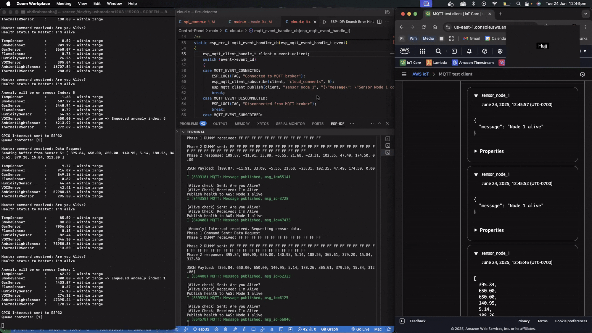

## 🚨 Smart Fire Detection System
An IoT-enabled fire safety solution featuring:
- **STM32-based Sensor Nodes** for real-time monitoring of fire/environmental parameters
- **ESP32 Fire Alarm Control Panel** serving as both gateway and cloud interface
- **Modular Architecture** using C++ Abstract Factory Pattern for flexible sensor management
- **Edge-to-Cloud Integration** with AWS IoT for remote monitoring and alerts
---
### 📌 Project Overview
- **STM32 Sensor Node** continuously monitor all sensors and communicates with the **ESP32 FACP** via **SPI**.
- **FACP conducts heartbeat checks** - pings the Sensor Node, receiving acknowledgments in normal operation.
- On anomaly, **Sensor Node raises an interrupt**, prompting the FACP to **request detailed sensor readings**.
- **Cloud reporting**: FACP transmits health metrics and emergency events via **MQTT (AWS IoT Core)**.
---
### 🔧 Key Features
✅ **Modular & Scalable Design**  
&nbsp;&nbsp;&nbsp;• **Abstract Factory Pattern** in C++ for dynamic sensor management.  
&nbsp;&nbsp;&nbsp;• **Plug-and-play expandability**: Add more Sensor Nodes to the FACP for larger deployments.  

✅ **Multi-Sensor Monitoring (Sensor Node STM32)** (Notes on [Notion](https://hajjsalad.notion.site/STM32-Slave-Notes-202a741b5aab803dbfbcdb8398551fd2))           
&nbsp;&nbsp;&nbsp;The sensor node has 3 groups of sensors:  
&nbsp;&nbsp;&nbsp;🔥 **Fire Detection**: Temperature, Smoke, Gas, Flame sensors    
&nbsp;&nbsp;&nbsp;💧 **Environmental**: Humidity, VOC sensors  
&nbsp;&nbsp;&nbsp;♨️ **Smart Sensing**: Ambient Light, Thermal IR sensors    
&nbsp;&nbsp;&nbsp;*(Supports up to 8 sensors per node with configurable thresholds)*   

✅ **Fire Alarm Control Panel Node (ESP32)** ([Notes on Notion](https://hajjsalad.notion.site/ESP32-Master-Notes-202a741b5aab80f1bd4bc3d5a1b6f6fd)) ([Doxygen Documentation](https://hajjsalad.github.io/Smart-Fire-Detection-System/esp32/))        
&nbsp;&nbsp;&nbsp;• **Active Monitoring**: Periodically checks sensor node health via SPI.  
&nbsp;&nbsp;&nbsp;• **Event-Driven Response**: Instantly reacts to interrupt-based anomaly alerts from sensor nodes.  
&nbsp;&nbsp;&nbsp;• **Scalable Architecture**: Supports daisy-chaining multiple sensor nodes for large-scale deployments.  

✅ **Robust Communication Stack**  
&nbsp;&nbsp;🔹 **UART Debugging**:  
&nbsp;&nbsp;&nbsp;&nbsp;&nbsp;&nbsp;• Serial logs for sensor status, diagnostics, and development.  
&nbsp;&nbsp;🔹 **Hardware Interrupt Line**:  
&nbsp;&nbsp;&nbsp;&nbsp;&nbsp;&nbsp;• Low-latency Sensor Node to FACP anomaly alerts (Node → FACP)  
&nbsp;&nbsp;🔹 **SPI**:  
&nbsp;&nbsp;&nbsp;&nbsp;&nbsp;&nbsp;• Heartbeat checks (FACP → Node → FACP)  
&nbsp;&nbsp;&nbsp;&nbsp;&nbsp;&nbsp;• On-demand sensor data transmission (Node → FACP)

✅ **Edge Processing**: Anomalies are identified at the sensor node level.   
✅ **Cloud Integration**: Lightweight AWS IoT Core messaging for live sensor status and emergency alerts.    


---
### 🧱 **Modular & Scalable Sensor Creation with Abstract Factory Pattern**
To support scalable deployments and dynamic sensor configuration, we use the Abstract Factory Pattern in C++. This allows the system to flexibly create related groups of sensors without hardcoding specific sensor types into the logic.

🧩 **Factory Structure**
```
                        ┌────────────────────┐  
                        │    SensorFactory   │ → Abstract base class  
                        └────────────────────┘  
                         ▲        ▲        ▲  
       ┌─────────────────┘        │        └─────────────────┐  
       ▼                          ▼                          ▼  
┌─────────────────┐       ┌────────────────────┐       ┌──────────────────┐  
 FireSensorFactory         EnvironSensorFactory         SmartSensorFactory   
└─────────────────┘       └────────────────────┘       └──────────────────┘
```
Each concrete factory creates a specific family of sensors:  
🔥 FireSensorFactory → Temp, Smoke, Gas, Flame Sensors  
🌿 EnvironSensorFactory → Humidity, VOC Sensors  
💡 SmartSensorFactory → Ambient Light, Thermal IR Sensors  

---
### 📡 **Two-Phase SPI Command-Response Protocol**  
This SPI communication protocol uses a two-phase approach to allow the slave device sufficient time to process incoming commands and prepare a response:  
&nbsp;&nbsp;🔁 **Phase 1: Command Transmission**  
&nbsp;&nbsp;&nbsp;&nbsp;&nbsp;&nbsp;• **Master (ESP32)** initiates communication by sending a command.    
&nbsp;&nbsp;&nbsp;&nbsp;&nbsp;&nbsp;• **Slave (STM32)** receives the command and replies with dummy bytes.   
&nbsp;&nbsp;&nbsp;&nbsp;&nbsp;&nbsp;&nbsp;&nbsp;• The slave parses the command and prepares the appropriate response for the next phase.   
&nbsp;&nbsp;📤 **Phase 2: Response Retrieval**  
&nbsp;&nbsp;&nbsp;&nbsp;&nbsp;&nbsp;• **Master** sends dummy bytes to generate clock cycles for the SPI bus.     
&nbsp;&nbsp;&nbsp;&nbsp;&nbsp;&nbsp;• **Slave** transmits the prepared response over SPI in real time.  

&nbsp;&nbsp;✅ **Health Status Check** – *"Are you alive?"*  
&nbsp;&nbsp;This is a basic handshake to check if the slave is responsive.
```
|           Master                          |            Slave                              |
|   Phase 1 Command Sent: "Are you alive?"  |   Phase 1 Command received: "Are you alive?"  |
|   Phase 1 DUMMY received: FF FF FF FF     |   Phase 1 DUMMY sent: FF FF FF FF             |
|                                           |                                               |
|   Phase 2 Command Sent: FF FF FF FF       |   Phase 2 Command received: FF FF FF FF       |
|   Phase 2 DUMMY received: "I'm alive"     |   Phase 2 DUMMY sent: "I'm alive"             |
```

📊 **Sensor Data Request** – *Triggered on Anomaly Detection*  
Upon detecting an anomaly, the master requests the latest sensor readings from the slave.
```
|           Master                          |            Slave                              |
|  Phase 1 Command Sent: "Data Request"     |   Phase 1 Command received: "Data Request"    |
|  Phase 1 DUMMY received: FF FF FF FF      |   Phase 1 DUMMY sent: FF FF FF FF             |
|                                           |                                               |
|  Phase 2 Command Sent: FF FF FF FF        |   Phase 2 Command received: FF FF FF FF       |
|  Phase 2 DUMMY received: "1.1, 2.2,..."   |   Phase 2 DUMMY sent: "1.1, 2.2, 3.3..."      |
```
---
### 🏗 System Architecture
```
[Sensors] → [STM32 Sensor Node] → [SPI] → [ESP32 FACP/Cloud Node] → [MQTT] → [Cloud Dashboard]
```
### 🛠️ Tools and Software
𐂷 **Sensor Node**  
&nbsp;&nbsp;&nbsp;⎔ **VS Code** - Primary code editor for STM32 firmware development      
&nbsp;&nbsp;&nbsp;⎔ **OpenOCD** - Used for flashing and debugging over SWD     
&nbsp;&nbsp;&nbsp;⎔ **Makefile** - Handles compilation, linking, and build automation   

🌐 **FACP / Cloud Gateway**     
&nbsp;&nbsp;&nbsp;⎔ **ESP-IDF** - Official development framework for ESP32 firmware    
&nbsp;&nbsp;&nbsp;⎔ **VS Code** - Development environment with ESP-IDF integration and UART debugging           
&nbsp;&nbsp;&nbsp;⎔ **AWS Cloud** - Powers the IoT backend with services like:  
&nbsp;&nbsp;&nbsp;&nbsp;&nbsp;• AWS IoT Core – Secure device connectivity and MQTT messaging   
&nbsp;&nbsp;&nbsp;&nbsp;&nbsp;• Amazon Timestream – Time-series database for storing sensor data  

### **Hardware Connections**
| **STM32 PIN** | **Interface**  | **ESP32 Pin** |
|---------------|----------------|---------------|
|     PA6       |     SPI MISO   |    GPIO19     |
|     PA7       |     SPI MOSI   |    GPIO23     |
|     PA4       |     SPI NSS    |    GPIO5      |
|     PA5       |     SPI SCK    |    GPIO18     |
|     PB6       | GPIO Interrupt |    GPIO22     |
|     GND       |      GND       |     GND       |

---
### 📂 Project Code Structure
```
📁 fire-detector/
│── 📁 Sensor-Node/                          (STM32F446RE firmware)
│   ├── 📁 Inc/                              (Header files)
│   │   ├── 📁 comm/                         (Communication drivers)
│   │   ├── 📁 sensors/                      (Sensor interfaces)
│   │   ├── 📁 tasks/                        (FreeRTOS task declarations)
│   │   ├── 📁 utils/                        (Utility headers)
│   │   ├── 📁 CMSIS/                        (ARM CMSIS headers)
│   │   └── 📁 STM32F4xx/                    (STM32 HAL headers)
│   ├── 📁 Src/                              (Source files)
│   │   ├── 📄 main.c                        (Entry point, FreeRTOS scheduler init)
│   │   ├── 📄 syscalls.c                    (System call stubs)
│   │   ├── 📁 comm/                         (Communication driver implementations)
│   │   │   ├── 📄 i2c1_driver.c
│   │   │   ├── 📄 spi1_driver.c
│   │   │   ├── 📄 uart1_driver.c
│   │   │   └── 📄 uart2_driver.c
│   │   ├── 📁 sensors/                      (Sensor driver implementations)
│   │   │   ├── 📄 bme680_enviro_sensor.c
│   │   │   ├── 📄 tmp102_temp_sensor.c
│   │   │   ├── 📄 button_flame_sensor.c
│   │   │   ├── 📄 simulate_smoke_sensor.c
│   │   │   └── 📄 simulate_gas_sensor.c
│   │   ├── 📁 tasks/                        (FreeRTOS task implementations)
│   │   │   ├── 📄 task_1_sensor_read.c
│   │   │   ├── 📄 task_2_anomaly_detect.c
│   │   │   ├── 📄 task_3_modbus_slave.c
│   │   │   └── 📄 task_4_system_logger.c
│   │   └── 📁 utils/                        (Utility implementations)
│   │       ├── 📄 crc_16.c
│   │       └── 📄 demo.cpp
│   ├── 📁 FreeRTOS/                         (FreeRTOS kernel source)
│   ├── 📁 Startup/                          (MCU startup assembly)
│   ├── 📁 Build/                            (Compiled output)
│   ├── 📄 STM32F446RETX_FLASH.ld            (Linker script — flash)
│   ├── 📄 STM32F446RETX_RAM.ld              (Linker script — RAM)
│   ├── 📄 Makefile                          (Build system configuration)
│   └── 📄 Doxyfile                          (Doxygen config)
│
│
│
│── 📁 Control-Panel/                        (ESP32 FACP + cloud node)
│   ├── 📁 main/                             (Application entry point)
│   ├── 📁 components/                       (ESP-IDF custom components)
│   │   ├── 📁 modbus/                       (MODBUS master implementation)
│   │   │   ├── 📁 include/
│   │   │   ├── 📄 modbus_master.c
│   │   │   ├── 📄 crc_16.c
│   │   │   └── 📄 CMakeLists.txt
│   │   └── 📁 uart/                         (UART driver component)
│   │       ├── 📁 include/
│   │       ├── 📄 uart2_driver.c
│   │       └── 📄 CMakeLists.txt
│   ├── 📄 CMakeLists.txt                    (Top-level ESP-IDF build config)
│   ├── 📄 sdkconfig                         (ESP-IDF SDK configuration)
│   ├── 📁 build/                            (Compiled output)
│   └── 📄 Doxyfile                          (Doxygen config)
│── 📄 README.md                             (Project documentation)
│── 📄 LICENSE
│── 📄 gdb_commands.gdb                      (GDB debug helper script)
└── 📄 demo.gif                              (Demo animation)
```
---
### 🎬 Demo



