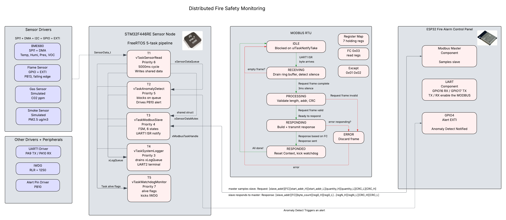
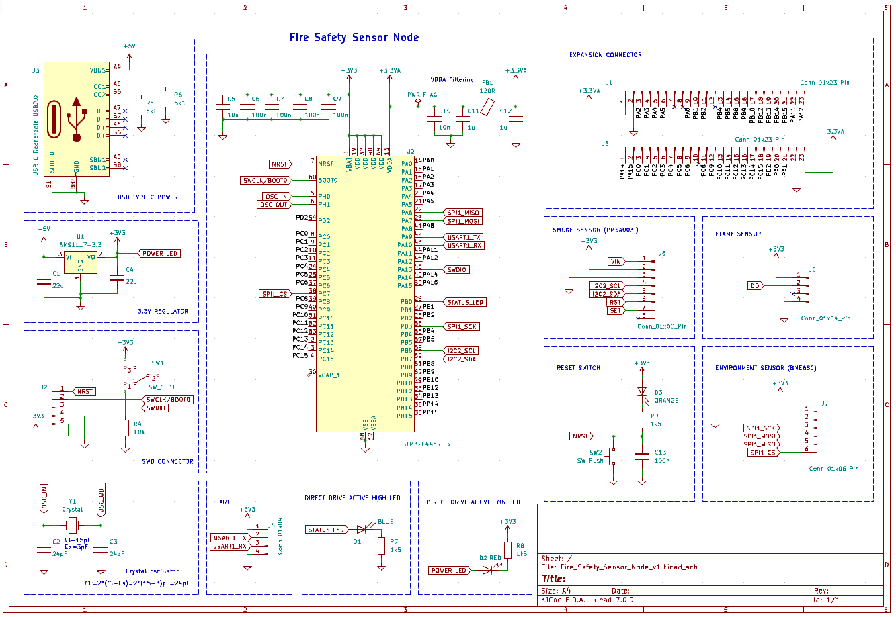

## 🚨 Distributed Fire Safety System
Commercial and industrial fire safety systems require continuous, reliable environmental monitoring across distributed building zones - detecting early signs of fire through temperature, smoke, gas, and flame signatures before conditions become critical. This project implements that class of system as a distributed embedded architecture, following the sensor node and central controller pattern used in products by Honeywell, Siemens, and Bosch.  
STM32 sensor node deployed across zones, continuously sample environmental telemetry and report to a central ESP32 Fire Alarm Control Panel (FACP) via MODBUS RTU over RS-485. The FACP aggregates data from the node for remote monitoring and alerting.

The project is organized into four components:
- 🟠 **STM32 Sensor Node** - environmental sensing, anomaly detection, and MODBUS slave communication
- 🔵 **MODBUS RTU** - industrial communication protocol implemented between sensor nodes and control panel
- 🔴 **ESP32 Fire Alarm Control Panel** - MODBUS master polling, and cloud gateway
- 🟢 **Sensor Node PCB Design** - KiCad schematic for a custom sensor node PCB with v1/v2 revision roadmap    
    


---

### 🟠 STM32 Sensor Node
The FreeRTOS-based sensor node continuously samples environmental telemetry across multiple sensor interfaces, performs on-device anomaly detection, and responds to MODBUS RTU polling requests from the ESP32 Fire Alarm Control Panel.   
#### 🔬 Sensor Stack
| Sensor | Measurement | Interface | Status |
|---|---|---|---|
| BME680 | Temperature, Humidity, Pressure, VOC | SPI1 + DMA2 | Real hardware |
| Smoke | PM2.5 Particulate Matter | - | Simulated |
| Gas | CO2 ppm | - | Simulated |
| Flame | Flame detected / not detected | GPIO Input | Real hardware |

#### 📡 Peripheral Drivers
**`SPI1` - BME680**   
Bare-metal SPI1 driver with register-level reads. Full duplex master, Mode 0 (CPOL=0, CPHA=0), 1MHz clock. CS manually controlled via PC7 GPIO. Burst read using BME680 auto-increment register pointer.
```
PB3 — SCK  (AF5)
PA7 — MOSI (AF5)
PA6 — MISO (AF5)
PC7 — CS   (GPIO output, active low)
```
**`DMA2`- SPI1 burst reads**   
DMA2 configured for SPI1 RX/TX to offload BME680 burst reads from the CPU. Register address sent via CPU (single byte), then DMA handles the multi-byte data transfer. TX stream sends dummy bytes to generate clock; RX stream captures BME680 response into buffer simultaneously.
```
Stream 0, Channel 3 - SPI1 RX (peripheral → memory, MINC enabled)
Stream 3, Channel 3 - SPI1 TX (memory → peripheral, MINC disabled — same dummy byte repeated)
```
**`UART1` - MODBUS RTU**   
Bare-metal UART1 driver at 115200 baud. ISR-driven ring buffer - ISR owns the head, `vTaskModbusSlave` owns the tail. Frame boundary detected via 3.5 character silence timeout (~2ms at 115200 baud).
```
PA9  — TX (AF7)
PA10 — RX (AF7)
```
**`GPIO Input` - Flame Sensor**    
PB13 configured as digital input with internal pull-up resistor. EXTI13 interrupt on both falling and rising edges. Active LOW — button/sensor pulls pin LOW on flame detection. Falling edge sets `volatile uint8_t flame_detected = 1`, rising edge clears it. Task 1 reads flag each 5 second cycle alongside other sensors — no polling required.
```
PB13 - Digital input (pull-up, EXTI13)
       Falling edge -> flame_detected = 1
       Rising edge  -> flame_detected = 0
```
**`GPIO Output` - Anomaly Alert**    
PB10 configured as GPIO output, idle LOW. Driven HIGH by `vTaskAnomalyDetect` when any sensor reading breaches a threshold. ESP32 `GPIO4` monitors this pin via rising edge interrupt — triggers an immediate urgent MODBUS poll rather than waiting for the next 5 second cycle.
```
PB10 — Digital output (active HIGH)
       HIGH -> anomaly detected → notifies ESP32 GPIO4
       LOW  -> normal operation
```
**`UART2` - Debug Logging**   
Dedicated UART for terminal debug output. `vTaskSystemLogger` is the sole writer - drains `xLogQueue` and transmits log messages without blocking other tasks.
```
PA2 - TX (AF7)
PA3 - RX (AF7)
```
**`IWDG` - Independent Watchdog**    
Hardware watchdog clocked by internal LSI oscillator (32kHz) — independent of system clock, cannot be disabled once started. `vTaskWatchdogMonitor` (Pri 7, highest) verifies all four tasks set their alive flags each cycle before kicking. If any task hangs and fails to set its flag — kick is withheld and MCU resets after timeout.
```
Prescaler  = /256  (PR = 6)
Reload     = 1250  (RLR)
Timeout    = (256 × 1250) / 32000 = 10 seconds
```

#### 🧵 Task Model
| Task | Priority | Responsibility |
|---|---|---|
| `vTaskSensorRead` | 6 | Samples all sensors, writes to `shared_sensor_data`, pushes to `xSensorDataQueue` |
| `vTaskAnomalyDetect` | 5 | Blocks on `xSensorDataQueue`, checks readings against thresholds, raises alert flag |
| `vTaskModbusSlave` | 4 | Polls UART ring buffer, parses MODBUS frames, reads `shared_sensor_data`, sends response |
| `vTaskSystemLogger` | 3 | Sole consumer of `xLogQueue` - drains and prints all log messages to UART terminal |
| `vTaskWatchdogMonitor` | 7 | Checks alive flags from all tasks every 10s - kicks IWDG if all healthy, withholds kick if any task hung |
#### 🔗 FreeRTOS Resources
| Resource | Type | Purpose |
|---|---|---|
| `xSensorDataMutex` | Mutex | Guards `shared_sensor_data` between `vTaskSensorRead` and `vTaskModbusSlave` |
| `xSensorDataQueue` | Queue | Passes `SensorData_t` from `vTaskSensorRead` → `vTaskAnomalyDetect` |
| `xLogQueue` | Queue | Passes log strings from all tasks → `vTaskSystemLogger` |

---
### 🔵 MODBUS RTU
The MODBUS RTU protocol stack is implemented entirely from scratch in C. The STM32 sensor node operates as a slave, ESP32 FACP operates as a master. The master polls the slave every 5000ms.
#### Register Map
| Address | Register | Unit | Scale | Example |
|---|---|---|---|---|
| 0x0000 | Temperature | °C | × 100 | 2631 = 26.31°C |
| 0x0001 | Humidity | %RH | × 100 | 4047 = 40.47% |
| 0x0002 | Pressure | hPa | × 10 | 10072 = 1007.2hPa |
| 0x0003 | VOC | Ω | × 1 | 147 = 147Ω |
| 0x0004 | CO2 | ppm | × 1 | 412 = 412ppm |
| 0x0005 | PM2.5 | µg/m³ | × 10 | 85 = 8.5µg/m³ |
| 0x0006 | Flame | 0/1 | × 1 | 1 = detected |

#### Function Codes
| FC | Name | Direction |
|---|---|---|
| 0x03 | Read Holding Registers | ESP32 reads sensor telemetry from STM32 |
| 0x06 | Write Single Register | ESP32 writes to STM32 (future) |

#### Slave State Machine
Six-state FSM in `vTaskModbusSlave`. Task blocks on `ulTaskNotifyTake` between frames - zero CPU at idle. `UART1` ISR notifies task on each incoming byte via `vTaskNotifyGiveFromISR`.
| FC | Name |
|---|---|
| IDLE | Blocked on task notification |
| RECEIVING | Drains ring buffer, detects 2ms silence gap |
| PROCESSING | Validates length, address, CRC-16 |
| RESPONDING | Reads shared_sensor_data, builds and transmits response |
| RESPONDED | Resets context, sets task3_alive watchdog flag |
| ERROR | Discards frame, resets context |

#### Master State Machine
Five-state FSM in `modbus_master_task` on ESP32. Polls slave every 5000ms.
| FC | Name |
|---|---|
| IDLE | Resets context via memset, transitions immediately to REQUESTING |
| REQUESTING | Builds FC 0x03 frame, transmits over UART2 via uart_write_bytes |
| PROCESSING | Blocks on uart_read_bytes with 1000ms timeout — transitions to PROCESSING or ERROR |
| RESPONDING | Validates CRC, checks slave address, scales registers to physical values |
| RESPONDED | Logs transaction complete, delays 5000ms before next cycle |
| ERROR | Logs fault, delays 5000ms before retry |

---

### 🔴 ESP32 Fire Alarm Control Panel
The ESP-IDF-based Fire Alarm Control Panel acts as the MODBUS RTU master - periodically polling STM32 sensor nodes over RS-485 and aggregating telemetry.
#### 🧩 Components
The ESP32 firmware is organized into ESP-IDF components - self-contained modules each with their own source, headers, and build configuration.  

| Component | Responsibility |
|---|---|
| `modbus` | MODBUS master task, frame construction, CRC-16, response parsing |
| `uart` | UART2 peripheral driver for RS-485 communication with STM32 nodes |
| `alert` | GPIO4 interrupt handler - notifies master task on anomaly detection |

#### 📡 Peripheral Drivers 
**UART2 - MODBUS RTU**     
ESP-IDF UART driver at 115200 baud. Master sends FC 0x03 read requests to STM32 slave nodes and receives sensor telemetry responses. Response timeout configurable per poll cycle.
```
GPIO17 — TX
GPIO16 — RX
```
**GPIO4 - Anomaly Alert Input**      
Configured as digital inout with rising edge interrupt. STM32 PB10 drives this pin HIGH when `vTaskAnomalyDetect` in sensor node breaches a threshold. 
```
GPIO4 — Digital input (rising edge interrupt)
        HIGH → anomaly detected on sensor node → urgent poll triggered
        LOW  → normal operation
```
#### 🧵 Task Model
| Task | Priority | Responsibility |
|---|---|---|
| `modbus_master_task` | 4 | Builds MODBUS requests, polls STM32 nodes, validates CRC, parses response, logs telemetry |
| `vTaskLogger` | 1 | Sole consumer of `xLogQueue` - drains and prints all log messages to UART terminal |
---
### 🟢 Sensor Node PCB Design
A custom `STM32F446RETx` sensor node PCB designed in KiCad.
#### 🔧 Version 1

---
### 📂 Project Code Structure
```
📁 fire-detector/
│── 📁 Sensor-Node/                          (STM32F446RE firmware)
│   ├── 📁 Inc/                              (Header files)
│   │   ├── 📁 comm/                         (Communication drivers)
│   │   ├── 📁 sensors/                      (Sensor interfaces)
│   │   ├── 📁 tasks/                        (FreeRTOS task declarations)
│   │   ├── 📁 utils/                        (Utility headers)
│   │   ├── 📁 CMSIS/                        (ARM CMSIS headers)
│   │   └── 📁 STM32F4xx/                    (STM32 HAL headers)
│   ├── 📁 Src/                              (Source files)
│   │   ├── 📄 main.c                        (Entry point, FreeRTOS scheduler init)
│   │   ├── 📄 syscalls.c                    (System call stubs)
│   │   ├── 📁 system/                      
│   │   │   └── 📄 iwdg_driver.c
│   │   ├── 📁 comm/                         (Communication driver implementations)
│   │   │   ├── 📄 exti_driver.c
│   │   │   ├── 📄 spi1_driver.c
│   │   │   ├── 📄 dma2_driver.c
│   │   │   ├── 📄 uart1_driver.c
│   │   │   ├── 📄 uart2_driver.c
│   │   │   └── 📄 alert_pin_driver.c
│   │   ├── 📁 sensors/                      (Sensor driver implementations)
│   │   │   ├── 📄 bme68x.c
│   │   │   ├── 📄 bme680_enviro_sensor.c
│   │   │   ├── 📄 button_flame_sensor.c
│   │   │   ├── 📄 simulate_smoke_sensor.c
│   │   │   └── 📄 simulate_gas_sensor.c
│   │   ├── 📁 tasks/                        (FreeRTOS task implementations)
│   │   │   ├── 📄 task_1_sensor_read.c
│   │   │   ├── 📄 task_2_anomaly_detect.c
│   │   │   ├── 📄 task_3_modbus_slave.c
│   │   │   ├── 📄 task_4_system_logger.c
│   │   │   └── 📄 task_5_watchdog_monitor.c
│   │   └── 📁 utils/                        (Utility implementations)
│   │       ├── 📄 crc_16.c
│   │       └── 📄 demo.cpp
│   ├── 📁 FreeRTOS/                         (FreeRTOS kernel source)
│   ├── 📁 Startup/                          (MCU startup assembly)
│   ├── 📁 Build/                            (Compiled output)
│   ├── 📄 STM32F446RETX_FLASH.ld            (Linker script — flash)
│   ├── 📄 STM32F446RETX_RAM.ld              (Linker script — RAM)
│   ├── 📄 Makefile                          (Build system configuration)
│   └── 📄 Doxyfile                          (Doxygen config)
│
│
│
│── 📁 Control-Panel/                        (ESP32 FACP + cloud node)
│   ├── 📁 main/                             (Application entry point)
│   ├── 📁 components/                       (ESP-IDF custom components)
│   │   ├── 📁 modbus/                       (MODBUS master implementation)
│   │   │   ├── 📁 include/
│   │   │   ├── 📄 modbus_master.c
│   │   │   ├── 📄 crc_16.c
│   │   │   └── 📄 CMakeLists.txt
│   │   └── 📁 uart/                         (UART driver component)
│   │       ├── 📁 include/
│   │       ├── 📄 uart2_driver.c
│   │       └── 📄 CMakeLists.txt
│   ├── 📄 CMakeLists.txt                    (Top-level ESP-IDF build config)
│   ├── 📄 sdkconfig                         (ESP-IDF SDK configuration)
│   ├── 📁 build/                            (Compiled output)
│   └── 📄 Doxyfile                          (Doxygen config)
│── 📄 README.md                             (Project documentation)
│── 📄 LICENSE
│── 📄 gdb_commands.gdb                      (GDB debug helper script)
└── 📄 demo.gif                              (Demo animation)
```
---
### 🎬 Demo
